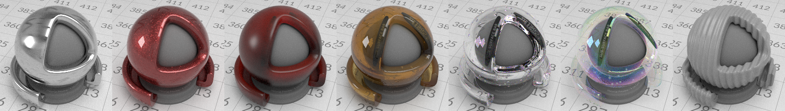
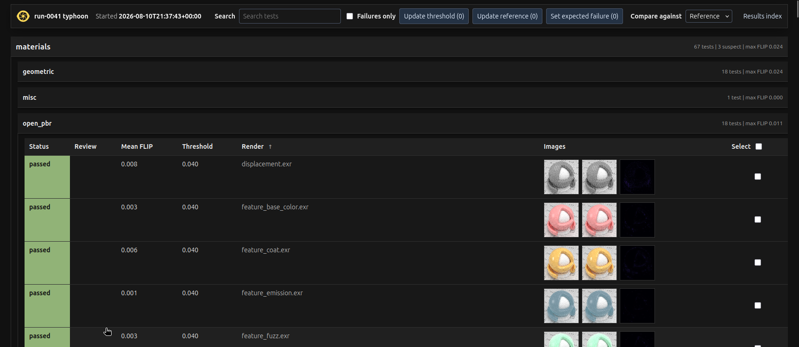
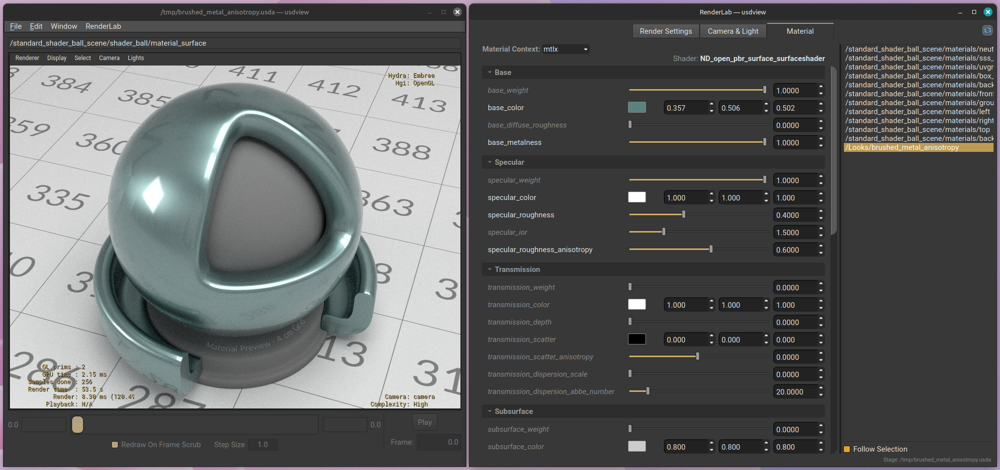

# Typhoon

Typhoon is a reference path tracer built into OpenUSD. It is intended to be a readable, community-developed, shared reference for how to implement standard USD features, such as UsdLux lighting, and UsdShade-based MaterialX materials.

Key features include:

- QMC path tracing
- Adaptive sampling
- UsdLux
- IES profiles
- C++ MaterialX implementation
- OpenPBR surface
- Subdivision surfaces
- Displacement
- Hydra AOVs

Typhoon is NOT intended to be a production renderer, nor a replacement for a viewport renderer such as Storm. It is not heavily optimized, but should be fast enough that image regression suites using it can run in a reasonable amount of time.

# Getting Started

After cloning as normal, the quickest and easiest way to build is with
[Pixi](https://pixi.prefix.dev/latest/installation/). The same configure and
build steps work on Linux, Windows, and macOS; Pixi automatically selects the
platform-specific configuration:
```bash
# from repo root, NOT pxr/imaging/plugin/hdEmbree
pixi run configure
pixi run build
pixi run ctest \
    --test-dir build/pxr/imaging/plugin/hdEmbree \
    --output-on-failure
```

Pixi will handle all dependencies and install the built OpenUSD distribution in its default environment. Once the build has completed, run:

```bash
# from repo root, NOT pxr/imaging/plugin/hdEmbree
pixi run usdview --renderer Embree --complexity high /path/to/scene.usd
```

to run `usdview` with Typhoon already selected as the default renderer. In
`usdview` you can use the `RenderLab` plugin to edit scene properties and
renderer settings at runtime, and to select the viewport AOV.

## Prebuilt Conda Packages

To just run OpenUSD with Typhoon without building anything, use the prebuilt conda packages:

```bash
pixi exec --spec openusd-typhoon \
--channel https://conda.anaconda.org/anderslanglands \
--channel conda-forge \
usdview --complexity high --renderer Embree /path/to/layer.usd
```

# Running Tests

## Unit Tests

To run the unit tests:
```bash
# from repo root, NOT pxr/imaging/plugin/hdEmbree
pixi run ctest \
    --test-dir build/pxr/imaging/plugin/hdEmbree \
    --output-on-failure
```

## Image Regression Tests

The image regression tests live in the separate
[typhoon-test-suite](https://github.com/anderslanglands/typhoon-test-suite)
repository. Clone its pinned assets and download the published reference images
before running the suite:

```bash
git clone --recursive https://github.com/anderslanglands/typhoon-test-suite.git
cd typhoon-test-suite
pixi run download-references
pixi run pytest
```

By default, the suite uses the packaged `openusd-typhoon` version pinned in its
`pixi.lock`. To test the build installed by this OpenUSD checkout instead,
create the following gitignored `goldeneye.local.toml` in the
`typhoon-test-suite` root. Replace `/path/to/OpenUSD` with the path to this
repository:

```toml
[renderers.typhoon]
command = [
    "pixi", "run",
    "--manifest-path", "/path/to/OpenUSD/pixi.toml",
    "--clean-env",
    "usdrender",
    "{usd_path}",
    "--outputRoot", "{suite_output_root}",
]
```

`pixi run pytest` accepts any test file or subtree. The available suite paths are:

| Path | Coverage |
|------|----------|
| `test-suite` | General renderer and material integration fixtures |
| `test-suite/furnace` | OpenPBR furnace and normal-map fixtures |
| `materials` | All renderer-focused material fixtures below |
| `materials/geometric` | Geometry inputs, primvars, and shading frames |
| `materials/misc` | Time-sampled behavior |
| `materials/open_pbr` | OpenPBR features, transmission, volume, and displacement |
| `materials/pbr` | MaterialX PBR closures, layers, subsurface, and volume |
| `materials/standard_surface` | Standard Surface features and transmission |
| `materials/textures` | Image formats, addressing, UDIMs, blur, and triplanar projection |
| `usdlux` | UsdLux lights, shaping, visibility, and IES behavior |

For example, run one subcategory or one fixture with:

```bash
pixi run pytest materials/pbr
pixi run pytest materials/open_pbr/displacement.usda
```

Each test run writes an HTML report below `_output/run-NNNN` and updates the
project-level `_output/index.html`. Serve the reports from the test-suite root
with:

```bash
pixi run view
```

Open <http://127.0.0.1:8000/> in a browser to select and inspect a run. Keep the
command running while viewing the report and press Ctrl-C to stop the server.



# usdrender

This branch also adds a new executable called `usdrender`. This, as its name suggests, renders a USD layer, writing `RenderProduct`s connected to the selected `RenderSettings` to disk.  

`usdrender` defaults to high mesh-refinement complexity. It uses an explicitly
requested renderer first, then a renderer authored on the selected
`RenderPass`, and otherwise defaults to Embree. `--complexity` and `--renderer`
override these defaults.

## Per-invocation attribute overrides

`usdrender -s` / `--set` authors repeatable attribute overrides into an
anonymous session layer without modifying the stage:

```sh
pixi run usdrender scene.usda -r Embree \
    -s "{settings}.ty:randomNumberSeed = 1" \
    -s "{settings}.ty:maxBounces = 8" \
    -s "/Camera.focalLength = 35"
```

# RenderLab

RenderLab is a bundled `usdview` plugin for interactively inspecting and
adjusting a scene while Typhoon is rendering. Open it from
`RenderLab > Open RenderLab` in the `usdview` menu bar.



RenderLab provides three tabs:

- **Render Settings** groups the active renderer's controls by purpose and
  applies changes immediately. The **Viewport AOV** menu switches the viewport
  between the renderer's available outputs, including Typhoon's
  `adaptiveHeatmap` and `ambocc` diagnostic AOVs.
- **Camera & Light** lists the cameras and lights on the stage and exposes their
  commonly used USD attributes. A camera can be made the view camera from its
  context menu. Enable **Interactive** to edit the selected camera with the
  usual Alt-drag viewport controls. Alt+Shift+left-drag rotates the selected
  dome light.
- **Material** lists materials for the MaterialX (`mtlx`) or universal
  (`default`) render context and exposes shader inputs using their Sdr
  metadata. **Follow Selection** selects the material bound to the current
  prim, and connected inputs can be followed upstream through the shader
  network.

Camera, light, and material edits are authored as session-layer overrides, so
the source USD layers are not modified. Renderer settings and the selected AOV
are runtime state for the current `usdview` session. Modified parameters can be
reset to the value they had when the editor was opened.

# Settings

| UI Name | Token | Type | Default |
|---------|-------|------|---------|
| Rendering Color Space | `renderingColorSpace` | `token` | `lin_rec709_scene` |
| Samples To Convergence | `ty:convergedSamplesPerPixel` | `int` | `256` |
| Random Number Seed | `ty:randomNumberSeed` | `int` | `-1` |
| Tile Size | `ty:tileSize` | `int` | `8` |
| Dome Light Camera Visibility | `domeLightCameraVisibility` | `bool` | `true` |
| Enable Exposure Compensation | `enableExposureCompensation` | `bool` | `true` |
| Dynamic Subdivision Tessellation | `ty:dynamicSubdvTesselation` | `bool` | `false` |
| Adaptive Threshold | `ty:adaptiveThreshold` | `float` | `0.01` |
| Min Samples Before Adaptive | `ty:minSamplesBeforeAdaptive` | `int` | `64` |
| Max Bounces | `ty:maxBounces` | `int` | `16` |
| Min Bounces Before Russian Roulette | `ty:minBouncesBeforeRR` | `int` | `2` |
| Light Samples Per Hit | `ty:lightSamplesPerHit` | `int` | `1` |
| Firefly Clamp Threshold | `ty:fireflyClampThreshold` | `float` | `20.0` |
| Enable Caustics | `ty:enableCaustics` | `bool` | `false` |
| Caustics Clamp Threshold | `ty:causticsClampThreshold` | `float` | `5.0` |
| Disable Shadows | `ty:disableShadows` | `bool` | `false` |
| Material Render Context | `ty:materialRenderContext` | `token` | `mtlx` |
| Use Adobe OpenPBR | `ty:useAdobeOpenPBR` | `bool` | `false` |
| Dielectric Layer Throughput Mode | `ty:dielectricLayerThroughputMode` | `token` | `bsdl` |
| Texture Cache Size (MB) | `ty:textureCacheSize` | `int` | `16384` |

## Rendering Behavior and Setting Descriptions

### Rendering Color Space (`renderingColorSpace`)
Selects the renderer working color space. RenderLab exposes
`lin_rec709_scene`, `lin_ap1_scene`, and `data`; `data` bypasses source color
transforms. This is the standard `UsdRenderSettings` attribute rather than a
Typhoon-namespaced setting.

### Hydra Lighting State

Lighting presentation follows `HdRenderPassState::GetLightingEnabled()` rather
than a Typhoon render setting. Enabled color passes always use path tracing and
evaluate only the lights supplied by Hydra. If scene-light pruning leaves no
light or emissive source, non-emissive surfaces remain black; hdEmbree does not
add a headlight or ambient fallback.

When Hydra disables lighting, color passes display authored `displayColor`
directly, or neutral gray `(0.5, 0.5, 0.5)` when it is unauthored. This unlit
presentation does not evaluate material closures, surface orientation, scene
lights, emission transport, indirect bounces, or ambient occlusion. Request the
independent `ambocc` AOV when that diagnostic is needed.

### Adaptive Sampling (`ty:adaptiveThreshold`, `ty:minSamplesBeforeAdaptive`)
Adaptive sampling is always active during progressive rendering. Per-pixel
variance is tracked using Welford's online algorithm. Pixels whose variance
metric falls below `ty:adaptiveThreshold` after at least
`ty:minSamplesBeforeAdaptive` samples are marked as converged and skipped in
subsequent passes. `ty:convergedSamplesPerPixel` remains the maximum sample
count for pixels that do not converge early. The default minimum sample count
is intentionally conservative enough to avoid stopping too early on rare
bright events such as sharp finite-light reflections, while still preserving
useful speedups for scenes with non-uniform complexity.
Each RGB channel is tested independently with a mixed absolute/relative variance-of-the-mean limit:

```text
varOfMean[c] <= absFloor + adaptiveThreshold * mean[c]^2
```

The absolute floor keeps near-black pixels from being judged only by relative error; the relative term makes `adaptiveThreshold=0.01` roughly mean that a channel has reached a 10% standard error of its mean. This avoids the hue bias of the legacy luminance metric, where red or blue surfaces can require more samples only because their luminance coefficients are small.

### Path Tracing Depth (`ty:maxBounces`, `ty:minBouncesBeforeRR`)
`ty:maxBounces` controls the maximum number of indirect light bounces (default `16`). Higher values capture more global illumination but increase render time. An SSS closure (entry + random walk + exit) counts as a single bounce, matching a plain diffuse surface hit. `ty:minBouncesBeforeRR` sets the minimum number of bounces before Russian Roulette path termination kicks in (default `2`). Paths shorter than this threshold are never randomly terminated, ensuring basic indirect illumination is always captured.

### Light Samples Per Hit (`ty:lightSamplesPerHit`)
Number of shadow/light samples taken per hit point per light source. Higher values reduce noise in direct lighting at the cost of render time. Samples are always stratified across the light surface. Must be >= 1.

### Caustics and Transparent Shadows (`ty:enableCaustics`, `ty:causticsClampThreshold`)
When `ty:enableCaustics` is `true`, hdEmbree keeps indirect reflective and
refractive caustics. Sharp lobes are regularized after the first non-specular
bounce, and caustic-path contributions are limited by
`ty:causticsClampThreshold`; set the threshold to `0` or below to disable that
clamp. Thick transmissive boundaries use conservative visibility rather than a
straight-through shadow approximation.

When caustics are disabled (the default), hdEmbree removes high-variance
caustic paths such as bright floor sparkles under glass. This deliberately
omits those contributions. Direct lighting through thick transmissive blockers
instead uses a biased, unrefracted RGB transparent-shadow approximation that
accounts for opacity, transmission, tint, and interior-medium attenuation.
Thin-walled transmission always uses straight RGB shadow attenuation in both
modes. A coupled thick dielectric remains conservatively opaque to a shadow
ray that originates on the same object.

The exact caustic classification, transparent-shadow policy, Fresnel/LUT
transition, and MIS constraints are documented in the
[lit segment loop](ARCHITECTURE.md#lit-segment-loop) and
[render settings](ARCHITECTURE.md#render-settings).

### Disable Shadows (`ty:disableShadows`)
When `ty:disableShadows` is `true`, shadow visibility rays return fully visible. Direct light sampling, emitted-light hits, dome evaluation, and camera visibility still run, so this removes occlusion along direct light paths without hiding lights or geometry from the camera. The default is `false`.

### Random Number Seed (`ty:randomNumberSeed`)
A value of `-1` (default) derives the OpenQMC seed from the scene frame. Any
other value selects an explicit deterministic/repeatable sampler sequence. Use
`usdrender -s "{settings}.ty:randomNumberSeed = 1"` for fixed-seed comparisons
without editing the stage.

## Subdivision complexity and MaterialX displacement

At `low` complexity, hdEmbree triangulates the authored subdivision control
cage without evaluating subdivision displacement. Higher complexities use
screen-space adaptive subdivision:

| Complexity | Geometry / target edge length |
|------------|-------------------------------|
| `veryhigh` | subdivision, 0.5 pixel |
| `high` | subdivision, 1 pixel |
| `medium` | subdivision, 4 pixels |
| `low` | triangulated control cage |

The target is measured after instance transforms. Displaced quadrilateral faces
may refine to at most twice the camera-derived level to follow screen-space
curvature without opening shared edges. See
[scene synchronization](ARCHITECTURE.md#scene-synchronization) for the
authoritative level, displacement, and commit invariants.

Subdivision requires an attached `HdCamera`. By default, the first camera and
valid viewport determine tessellation for the render pass lifetime. Set
`ty:dynamicSubdvTesselation = true` to recompute after camera or viewport
changes; expensive displacement graphs can make those updates costly.
Instance, topology, and display-style changes still update affected geometry.
Meshes with `subdivisionScheme = "none"` remain triangles at every complexity.

Vertex, varying, uniform, and indexed face-varying primvars retain their Hydra
interpolation and seam behavior. Embree cannot distinguish OpenSubdiv's
`cornersOnly`, `cornersPlus1`, and `cornersPlus2` face-varying rules, so those
three produce the same closest-supported corner behavior.

A material can connect `ND_displacement_float` to its `displacement` terminal.
Displacement applies only at medium or higher complexity to a subdivision
scheme such as `catmullClark`. The graph receives object-space position and
normal, `st`, numeric geomprops at supported Hydra interpolations, and constant
string/filename geomprops. Embree limits interpolated subdivision attributes
to float-based scalar/vector types. Point-instancer transforms and per-instance
primvars cannot vary a shared prototype's displacement.

MaterialX `geompropvalue` names must be constant strings. Connected, absent, or
non-string names produce one recoverable diagnostic and make only that node
evaluate its authored default.

Material terminals are validated when the material is synchronized. A
malformed surface/displacement graph emits one warning identifying the
material, terminal, and first failing node; unauthored optional terminals
remain silent. Volume-only materials create a transparent participating-medium
boundary, including where all evaluated medium coefficients are zero.
Mixing surface-shader closures preserves that boundary identity only when
every input with nonzero weight is itself a volume boundary.
Displacement-only materials use display-color fallback shading on the displaced
surface. A material with none of these usable terminals warns about its missing
surface. A malformed displacement-only material emits its actionable
displacement warning without also treating the intentionally absent surface as
an error. Rejected surface graphs retain the display-color fallback, while
rejected displacement graphs leave the surface undisplaced.
Unexpected displacement backend failures produce a runtime error and leave the
affected generated vertex undisplaced.

## Hydra wireframe display

hdEmbree honors the standard mesh `wireOnSurf`, `refinedWireOnSurf`, `wire`,
and `refinedWire` reprs selected by clients such as usdview. Wire-on-surface is
the recommended mode: it composites a screen-space line over the final shaded
camera result, using `HdRenderPassState`'s wire color, alpha, and line width. An
unset zero wire color follows Storm's convention and dims the shaded surface
along edges. Changing usdview's render mode resynchronizes existing meshes, so
switching between smooth, wire, and wire-on-surface takes effect immediately.
Wire-only mode performs only the camera intersection and geometric wire
coverage evaluation. It skips material evaluation, lighting, ambient
occlusion, volumes, and secondary bounces, and draws opaque black lines over
the clear color regardless of the render-pass wire color.

At low complexity, the overlay shows the rendered control-cage triangles,
including diagonals. At higher complexity it follows the final adaptive,
displaced diced grid. Subpixel cells appear as filtered dense coverage; zoom or
increase output resolution to resolve them. Line width stays in framebuffer
pixels and is stable during progressive rendering.

Embree does not expose its private transition-fan triangle IDs, so stitch
diagonals where opposing subdivision levels differ are approximate. Wire-only
mode shows the nearest surface and does not reveal rear edges. Use
wire-on-surface for final-render diagnostics. The reconstruction and repr-sync
invariants are documented under
[scene synchronization](ARCHITECTURE.md#scene-synchronization).

## RenderProduct output

hdEmbree writes active stage-authored `RenderProduct` files only for offline
clients that set Hydra's `enableInteractive` render setting to `false`. An
unset value is treated as interactive, so viewers such as usdview render the
products into their viewport without writing their `productName` paths.
`usdrender` explicitly selects offline mode. hdEmbree writes products only
after the frame both passes renderer setup and converges; a failed setup leaves
the expected product absent so `usdrender` reports an error.

## AOVs

| AOV | Required format |
|-----|-----------------|
| `color` | `Float32Vec3/4`, `UNorm8Vec3/4`, or `SNorm8Vec3/4` |
| `depth`, `cameraDepth` | `Float32` |
| `primId`, `instanceId`, `elementId` | `Int32` |
| `normal`, `Neye` | `Float32Vec3` |
| `primvars:<name>` | `Float32Vec3` |
| `adaptiveHeatmap` | `Float32Vec4` |
| `ambocc` | `Float32Vec3` |

### Adaptive heatmap
When this AOV is bound, it accumulates a heatmap of per-pixel sampling
progress. After the adaptive sample counter is advanced, each sample maps
`(updatedSampleCount + 1) / convergedSamplesPerPixel` through a blue -> cyan ->
green -> yellow -> red ramp. Multisample resolve averages those per-sample ramp
colors, so the resolved pixel visualizes its sampling history rather than being
a direct color lookup of its final sample count.

If it is the only bound AOV, hdEmbree still evaluates scene radiance so
convergence reflects the same signal as beauty rendering. In usdview, choose
`Renderer > Hydra AOVs > Other...` and enter `adaptiveHeatmap`, or open
`RenderLab > Render Settings > AOV` and select `adaptiveHeatmap` from
`Viewport AOV`. The heatmap is computed only while that AOV is bound and never
replaces the color AOV.

### Ambient occlusion
When `ambocc` is bound, hdEmbree traces one cosine-weighted ambient-visibility
ray for every progressive pixel sample that hits ordinary geometry. The
unoccluded fraction is stored as the same linear value in all three RGB
channels: zero is fully occluded and one is fully open. Misses issue no AO ray
and contribute zero so camera or scene restarts cannot retain stale resolved
pixels.

`ty:convergedSamplesPerPixel` is both the progressive sample limit and the
maximum number of AO rays per pixel; there is no separate enable flag or AO
sample-count setting. Adaptive sampling may stop a converged pixel earlier.
When `ambocc` is the only bound AOV, its scalar visibility samples drive the
convergence statistics without evaluating material closures or path lighting.
When color is also bound, AO remains independent and never changes the beauty
sample. In usdview, choose `Renderer > Hydra AOVs > Other...` and enter
`ambocc`, or open `RenderLab > Render Settings > AOV` and select `ambocc` from
`Viewport AOV`.

Before rendering, hdEmbree requires at least one hdEmbree-owned AOV buffer,
supported AOV formats, matching non-zero buffer dimensions, and a non-empty
data window contained by every buffer. Invalid setup emits a specific warning,
performs no sampling or buffer mapping, and terminates that render invocation.
Legacy viewport clients that use neither Hydra's framing API nor explicit AOV
bindings receive anonymous color and depth buffers; render-pass convergence
follows those internal buffers. Clients that supply valid Hydra framing must
also provide AOV bindings. Without them, anonymous buffers are not allocated
and the invocation settles as a failed frame, so it cannot write a stale
`RenderProduct`.

## Material Interpretation Notes

### Normal orientation and double-sided shading

hdEmbree keeps the authored-outside facet normal separate from smooth,
displaced, and material-mapped shading normals. Boundary crossings, media, and
ray offsets use only the facet normal. Normal and bump maps are evaluated in a
view-independent exterior frame, validated against the smooth or displaced
surface, and then faced to the incident side. Invalid or inverted mapped
normals fall back to the underlying surface normal, preserving one relief field
across both sides of a dielectric.

hdEmbree corrects glossy and subsurface normals near coarse geometric
terminators and rejects sampled reflection or transmission directions that
cross the wrong side of the geometric or lobe surface. Strong normal maps at
grazing angles can therefore appear darker than true displacement. Thick
dielectrics use the geometric side for medium transitions; thin-walled
transmission never changes persistent medium state.

The normal lifecycle, per-lobe correction, sampling constraints, derivative
handling, and shadow-terminator offset are documented under
[material compilation and evaluation](ARCHITECTURE.md#material-compilation-and-evaluation)
and the [lit segment loop](ARCHITECTURE.md#lit-segment-loop).

### Rough and thin-walled transmission

Rough-transmission transport is selected by the material model. OpenPBR and
metalness-workflow UsdPreviewSurface use the compensated coupled dielectric
interface. Rough glossy events use BSDL's bounded reflection-VNDF sampler and
select reflection or refraction using exact Fresnel. BSDL's directional
missing-energy table scales both evaluations together; it does not add a
separate compensation lobe to sampling. Direct-light evaluation is truncated
to the same bounded-normal support, preventing rough glass from gaining energy
under next-event estimation. Standard Surface keeps
its established separate reflection layer and transmission lobe for
compatibility, including its layered Fresnel attenuation and support for
`transmission_extra_roughness`.

Standard Surface `thin_walled` transmission uses a separate IOR-1 dielectric
lobe, so transmitted rays remain straight through even when the authored
specular IOR or roughness is nonzero. OpenPBR `geometry_thin_walled` instead
uses its coupled thin-sheet interface: the authored IOR still controls Fresnel,
and nonzero roughness may blur transmission as defined by that model.

### Subsurface radius vs. Cycles / Blender Principled BSDF

hdEmbree's random-walk SSS treats the final per-channel radius (`subsurface_radius * subsurface_radius_scale` in OpenPBR, `Subsurface Radius * Subsurface Scale` in Principled BSDF) as the **physical mean free path** fed directly into the Chiang 2016 remap. No additional scaling is applied.

Cycles, in contrast, multiplies the incoming radius by `1 / (4π) ≈ 0.0796` inside `bssrdf_setup_radius` ([cycles/src/kernel/closure/bssrdf.h](https://projects.blender.org/blender/cycles/src/branch/main/src/kernel/closure/bssrdf.h)). Cycles' own comment describes this as a perceptual compatibility shim "so it gives similar looking result to older Cubic, Gaussian and Burley models" — it is not physically motivated, and hdEmbree intentionally does not replicate it because hdEmbree does not support those legacy BSSRDF models.

**Practical consequence**: a radius value that looks right in Cycles will scatter roughly `4π ≈ 12.6×` more densely in hdEmbree. To port material values:

- **Cycles radius → hdEmbree radius**: divide by `4π` (~12.6).
- **hdEmbree radius → Cycles radius**: multiply by `4π` (~12.6).

Everything else (the Chiang albedo → α polynomial remap, the random-walk step cap of 256, Dwivedi guided sampling, MIS channel selection) matches Cycles directly.

# Contributing

Please make PRs to this repository targeting the `typhoon/main` branch. This is a community-driven project and we look forward to your contributions. In particular we are eager to merge:

- Correctness and bug fixes.
- Missing functionality, as prescribed by OpenUSD. For example, we do not currently support UsdVol volumes.
- Readability enhancements and code simplification: anything that makes the code easier to grok for humans is hugely beneficial.
- Optimizations, as long as they don't hurt readability: Typhoon is a reference renderer, not a production renderer, but we'd still like regression suites to run as fast as possible. Optimizations that _also_ simplify the code are particularly welcome.

## Features TODO list

- [ ] UsdGeomCurve & Chiang hair BSDF
- [ ] Motion blur
- [ ] UsdVol volumes (VDB fields)
- [ ] Light Path Expressions and standard AOV names
- [ ] Mesh lights
- [ ] Merge typhoon/physical-lighting

## Navigating the code

```text
hdEmbree/
├── delegate/              Hydra integration and scene-data translation
├── renderer/              CPU path tracer and renderer-owned support code
│   ├── aov/               AOV accumulation and output
│   ├── camera/            Camera and primary-ray sampling
│   ├── geometry/          Hit data, primvars, and surface geometry helpers
│   ├── integrator/        Path tracing, lighting, volumes, and subsurface transport
│   ├── lights/            Light representations and sampling
│   ├── materials/         MaterialX evaluation and texture access
│   │   ├── BSDL/          BSDF closures and supporting scattering code
│   │   └── MaterialXCpp/  CPU MaterialX graph compiler and evaluator
│   └── sampling/          OpenQMC sequence and sample-domain management
├── schema/                TyphoonRenderSettingsAPI schema
├── testenv/               Focused C++ tests
└── doc/                   Images and supporting design notes
```

For a more detailed guide to the design and code structure, see
[`ARCHITECTURE.md`](ARCHITECTURE.md).
